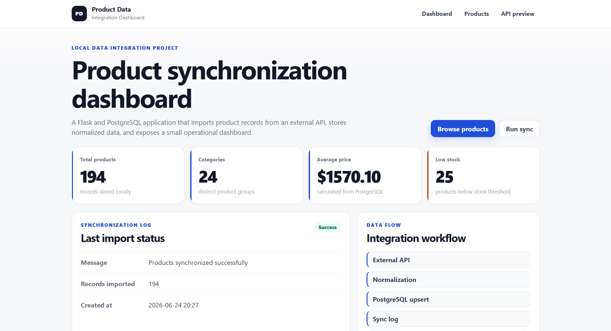
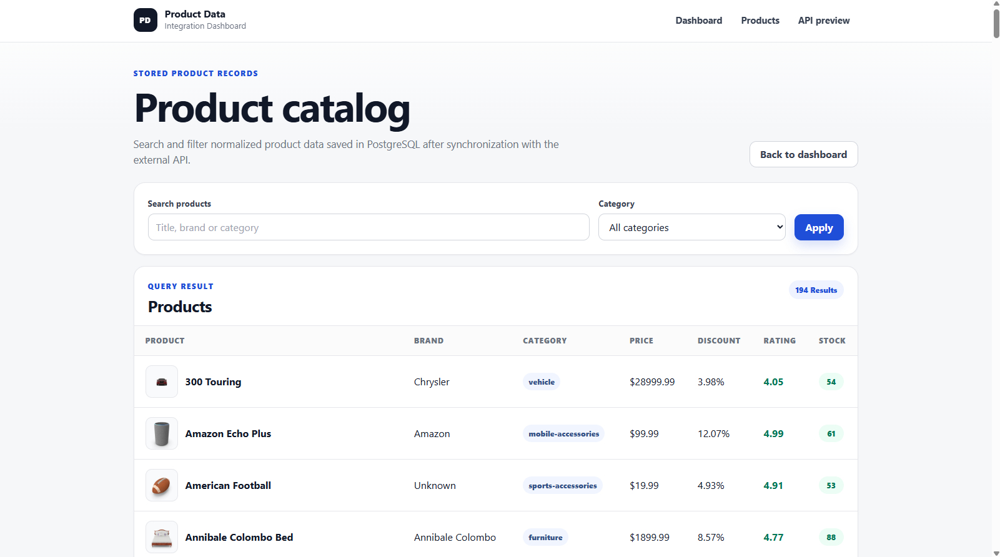

# API Data Integration Dashboard

A small Flask and PostgreSQL dashboard for importing product data from an external API, storing it locally, logging synchronization results, and browsing the imported records through a server-rendered UI.

This is a portfolio-focused MVP. The main goal is to show a realistic backend workflow: API integration, JSON normalization, PostgreSQL persistence, upsert logic, SQL-based dashboard statistics, sync logs, Jinja2 templates, and manual QA documentation.

## Status

Working local MVP.

Implemented flow:

```text
DummyJSON Products API
→ Python requests
→ product data normalization
→ PostgreSQL upsert by external_id
→ sync_logs entry
→ Flask/Jinja2 dashboard
```

The project currently supports manual synchronization, duplicate prevention, product search, category filtering, product thumbnails, paginated product browsing, dashboard statistics, styled HTML views, and documented manual QA checks.

## Screenshots

### Dashboard



### Products



## Features

- Fetches products from the DummyJSON Products API.
- Normalizes raw JSON into a controlled local product structure.
- Stores products in PostgreSQL.
- Uses `external_id` and PostgreSQL upsert logic to avoid duplicates.
- Saves synchronization results in a separate `sync_logs` table.
- Shows dashboard statistics from SQL queries:
  - total products,
  - category count,
  - average price,
  - low-stock product count.
- Displays last synchronization status and timestamp.
- Provides a product list with search and category filtering.
- Displays product thumbnails from the stored `thumbnail_url` value, with a fallback when an image is missing.
- Paginates the product list so the catalog does not render every matching row at once.
- Uses shared Jinja2 templates and custom CSS styling.
- Includes manual QA documentation for the main MVP flow.

## Tech Stack

- Python 3
- Flask
- PostgreSQL
- psycopg2-binary
- requests
- python-dotenv
- Jinja2
- HTML / CSS
- Git / GitHub

## Why I Built This

I built this project to practice the kind of backend workflow that appears in real data-driven applications: importing external data, cleaning it into a stable internal format, saving it in a relational database, preventing duplicate records, and making the result visible in a dashboard.

The project is intentionally small, but it is not just a fetch-and-display exercise. The important part is the full data flow: external API → normalization → PostgreSQL → synchronization log → dashboard.

One of the most useful parts was working through the synchronization flow: repeated imports should update existing products instead of creating duplicates, and the sync log should show what actually happened during the import.

## How It Works

### 1. External API integration

The application fetches product data from:

```text
https://dummyjson.com/products?limit=0
```

The API request is handled in:

```text
services/api_client.py
```

The `fetch_products()` function sends the request, checks for HTTP errors, validates the response shape, and returns a structured result to the Flask routes.

Example result:

```python
{
    "success": True,
    "products": [...],
    "message": "Products fetched successfully"
}
```

If the API request fails or the response format is unexpected, the function returns `success: False` with an error message and an empty product list.

### 2. Product normalization

The external API returns more fields than this project needs. Before saving anything to PostgreSQL, the application normalizes each product into a smaller structure:

```python
{
    "external_id": 1,
    "title": "Essence Mascara Lash Princess",
    "brand": "Essence",
    "category": "beauty",
    "price": 9.99,
    "discount_percentage": 7.17,
    "rating": 4.94,
    "stock": 5,
    "thumbnail_url": "https://example.com/image.png"
}
```

This keeps the database schema stable and avoids depending on the full raw API response throughout the application.

### 3. PostgreSQL upsert

Repeated synchronization should update existing products instead of creating duplicates.

The project uses:

```sql
ON CONFLICT (external_id) DO UPDATE
```

This means:

- a new external product is inserted,
- an existing external product is updated,
- repeated syncs do not create duplicate rows.

### 4. Synchronization logging

Each sync attempt writes a record into `sync_logs` with:

- status,
- message,
- number of imported records,
- timestamp.

Supported statuses:

- `success`,
- `partial_success`,
- `error`.

This makes the synchronization process visible instead of hiding it inside the backend.

### 5. Product catalog rendering

The `/products` page reads saved product records from PostgreSQL and renders them through a Jinja2 table.

For each product, the table now uses the stored `thumbnail_url` value to show a small product image. If a product does not have a thumbnail, the UI shows a compact fallback marker instead of leaving the row visually broken.

The product catalog is paginated. The route accepts a `page` query parameter, counts all matching records, and then fetches only one page of rows using SQL `LIMIT` and `OFFSET`.

## Routes

| Route | Method | Description |
|---|---:|---|
| `/` | GET | Dashboard with product statistics and latest sync information. |
| `/products` | GET | Paginated product table with thumbnails, optional search, and category filtering. |
| `/sync` | POST | Runs product synchronization from the dashboard, writes a sync log, flashes the result message, and redirects back to `/`. |
| `/sync-preview` | GET | Fetches and normalizes API data without saving it. |
| `/db-test` | GET | Checks the PostgreSQL connection. |

Example product filters:

```text
/products?search=phone
/products?category=smartphones
/products?search=phone&category=mobile-accessories
/products?page=2
/products?search=phone&page=2
```

## Database Schema

### `products`

```sql
CREATE TABLE products (
    id SERIAL PRIMARY KEY,
    external_id INTEGER UNIQUE NOT NULL,
    title VARCHAR(255) NOT NULL,
    brand VARCHAR(255),
    category VARCHAR(100),
    price NUMERIC(10, 2),
    discount_percentage NUMERIC(5, 2),
    rating NUMERIC(3, 2),
    stock INTEGER,
    thumbnail_url TEXT,
    created_at TIMESTAMP DEFAULT CURRENT_TIMESTAMP,
    updated_at TIMESTAMP DEFAULT CURRENT_TIMESTAMP
);
```

`external_id` stores the product ID from the external API. It is unique, so the application can safely detect whether a product already exists locally.

`updated_at` is updated by the application layer during upsert. There is no database trigger for it yet.

### `sync_logs`

```sql
CREATE TABLE sync_logs (
    id SERIAL PRIMARY KEY,
    status VARCHAR(50) NOT NULL,
    message TEXT,
    records_imported INTEGER DEFAULT 0,
    created_at TIMESTAMP DEFAULT CURRENT_TIMESTAMP
);
```

`sync_logs` records the result of each synchronization attempt.

## Project Structure

```text
api-data-integration-dashboard/
├── app.py
├── config.py
├── requirements.txt
├── README.md
├── .env.example
├── .gitignore
├── database/
│   ├── db.py
│   └── schema.sql
├── services/
│   └── api_client.py
├── templates/
│   ├── base.html
│   ├── index.html
│   └── products.html
├── static/
│   └── style.css
├── screenshots/
│   ├── dashboard.png
│   └── products.png
└── docs/
    ├── architecture.md
    └── qa/
        ├── 00-context.md
        ├── 01-current-state-review.md
        ├── 02-test-charter.md
        ├── 03-test-cases.md
        ├── 04-test-execution-log.md
        ├── 05-bug-reports-and-observations.md
        └── evidence/
```

## Local Setup

### 1. Clone the repository

```bash
git clone https://github.com/macus450-crypto/api-data-integration-dashboard.git
cd api-data-integration-dashboard
```

### 2. Create and activate a virtual environment

```bash
python -m venv venv
```

Windows PowerShell:

```powershell
.\venv\Scripts\Activate.ps1
```

macOS/Linux:

```bash
source venv/bin/activate
```

### 3. Install dependencies

```bash
pip install -r requirements.txt
```

### 4. Configure environment variables

Create a `.env` file based on `.env.example`:

```env
DB_HOST=localhost
DB_NAME=api_dashboard_db
DB_USER=postgres
DB_PASSWORD=your_password_here
DB_PORT=5432
SECRET_KEY=your_secret_key_here
```

`SECRET_KEY` is required by Flask to sign session data and flash messages. Use a unique, private value in your local `.env` file and do not commit the real `.env` file to Git.

### 5. Create the database and run the schema

```bash
psql -U postgres -c "CREATE DATABASE api_dashboard_db;"
psql -U postgres -d api_dashboard_db -f database/schema.sql
```

> Warning: `database/schema.sql` drops existing `products` and `sync_logs` tables before recreating them. Use it for local setup or reset only.

### 6. Run the application

```bash
python app.py
```

Open:

```text
http://127.0.0.1:5000
```

## Manual Testing

Basic local test flow:

```http
GET /db-test
GET /sync-preview
GET /
POST /sync via the dashboard "Run sync" button
GET /products
GET /products?page=2
GET /products?search=phone
GET /products?category=smartphones
```

After clicking **Run sync**, the application redirects back to the dashboard and shows a flash message with the synchronization result. The latest synchronization panel should also update from the newest `sync_logs` entry.

Expected successful sync behavior:

- the browser stays in the dashboard flow instead of showing raw JSON,
- a success flash message appears above the dashboard content,
- the message includes the number of imported or updated records,
- the latest synchronization section shows status, message, records imported, and timestamp.

Expected product catalog behavior:

- product rows show a thumbnail when `thumbnail_url` is available,
- rows without a thumbnail show a small fallback marker,
- the page shows a limited number of products at once,
- pagination controls preserve active search and category filters,
- search and category filters still work with the thumbnail column visible.

Useful SQL checks:

```sql
-- Imported products
SELECT COUNT(*) FROM products;

-- Recent sync history
SELECT status, message, records_imported, created_at
FROM sync_logs
ORDER BY created_at DESC
LIMIT 5;

-- Low-stock products
SELECT title, brand, stock
FROM products
WHERE stock < 10
ORDER BY stock ASC;

-- Category summary
SELECT category, COUNT(*) AS total, ROUND(AVG(price), 2) AS avg_price
FROM products
GROUP BY category
ORDER BY total DESC;
```

## Manual QA Documentation

The project includes a manual QA pass for the main MVP flow. The checks cover:

- database connection,
- API preview,
- product synchronization,
- dashboard statistics,
- product list rendering,
- search,
- category filtering,
- combined search and filtering,
- product pagination,
- empty result behavior,
- repeated synchronization and duplicate prevention.

QA files are available in [`docs/qa`](docs/qa):

- [`00-context.md`](docs/qa/00-context.md)
- [`01-current-state-review.md`](docs/qa/01-current-state-review.md)
- [`02-test-charter.md`](docs/qa/02-test-charter.md)
- [`03-test-cases.md`](docs/qa/03-test-cases.md)
- [`04-test-execution-log.md`](docs/qa/04-test-execution-log.md)
- [`05-bug-reports-and-observations.md`](docs/qa/05-bug-reports-and-observations.md)

All manual test cases from TC-001 to TC-011 passed in the tested local environment.

> Note: QA evidence includes refreshed pagination screenshots for TC-011. Some historical screenshots from before the `/sync` POST and flash-message update are still kept as historical evidence and should be refreshed in a later QA pass.

## Current Limitations

- The application runs locally and is not deployed yet.
- Synchronization is triggered manually.
- `/sync` is triggered through a POST form and redirects back to the dashboard with a flash message.
- The product list does not include sorting yet.
- There are no charts yet.
- There are no automated tests yet.
- There is no authentication.
- Some QA evidence screenshots still need to be refreshed after the `/sync` POST and flash-message update.

## Roadmap

### Next

- Add sorting to the product list.
- Add automated tests for product normalization and database helper functions.
- Refresh QA evidence screenshots for the current `/sync` POST and flash-message flow.

### Later

- Add charts for categories, prices, and stock levels.
- Add Docker and deployment configuration.
- Add scheduled synchronization.
- Add more advanced filtering.
- Add authentication if the dashboard becomes more admin-facing.
- Consider SQLAlchemy if the database layer grows more complex.

## What I Practiced

This project helped me practice a full backend data flow instead of isolated Flask routes:

- fetching and normalizing JSON data from an external API,
- designing PostgreSQL tables for imported product data and sync logs,
- using `external_id` and upsert logic to prevent duplicate records,
- writing SQL queries for filtering, grouping, and dashboard statistics,
- adding SQL pagination with `LIMIT`, `OFFSET`, and a matching `COUNT(*)` query,
- logging synchronization results to make imports easier to verify,
- rendering stored image URLs safely in a server-rendered product table,
- rendering database data through Jinja2 templates.

The most useful part was connecting these pieces into one flow: API client → database layer → Flask route → dashboard.
